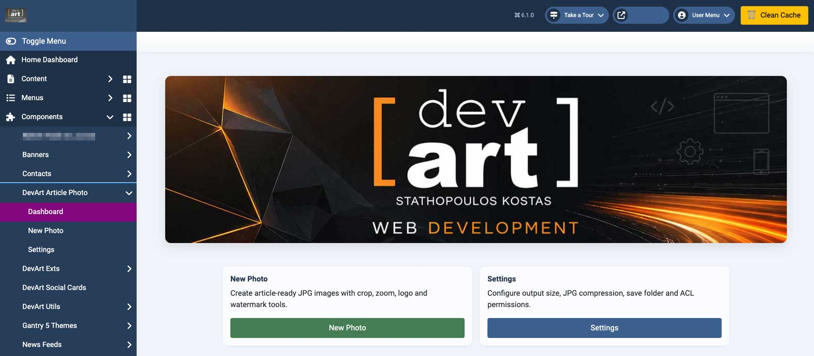
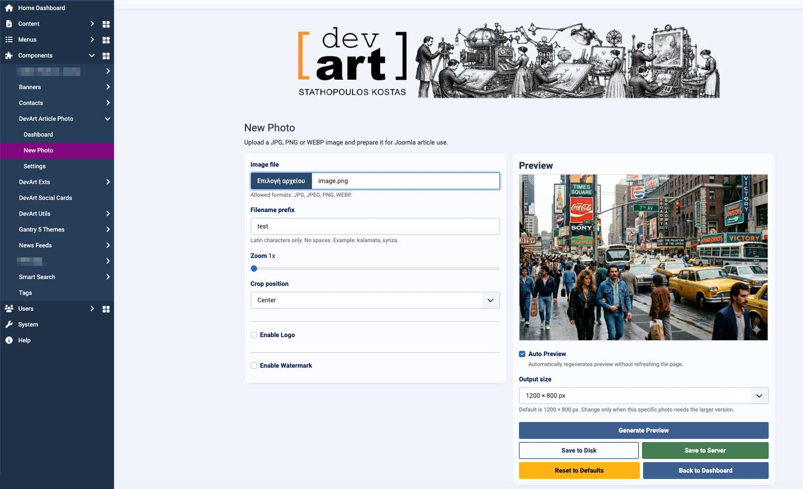
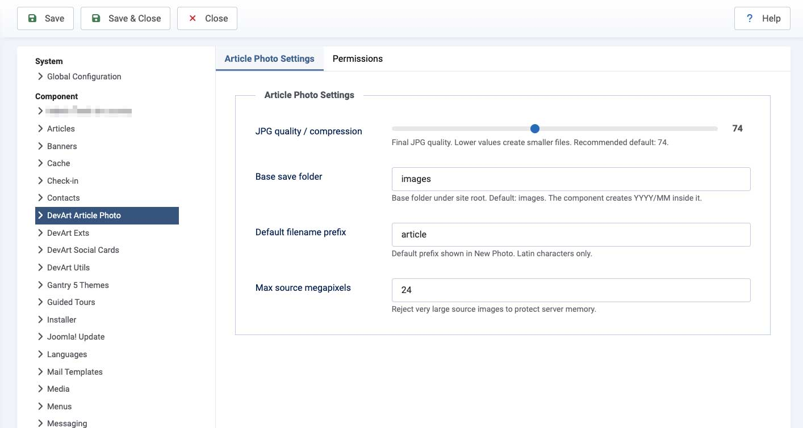
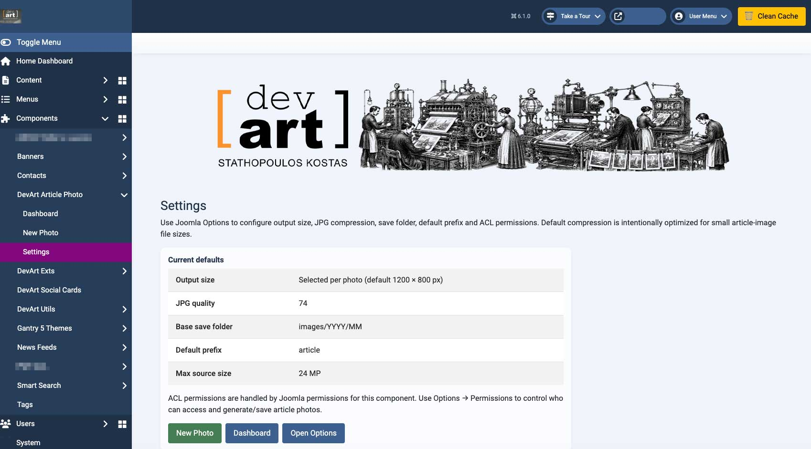

# DevArt Article Photo for Joomla


Lightweight Joomla 6 component for generating optimized article-ready images for news and editorial websites.

DevArt Article Photo helps editors quickly prepare clean, lightweight and properly sized article images directly inside Joomla with a fast and simple workflow optimized for high-traffic publishing environments.

---

# ✨ Features

✅ Generate optimized JPG article images from:
- JPG
- PNG
- WEBP

✅ Per-image output size selection:
- 1200 × 800
- 1620 × 1080

✅ Crop position and zoom controls  
✅ Real-time Auto Preview without page refresh  
✅ Optional logo overlay  
✅ Optional center watermark overlay  
✅ Instant image download  
✅ Save directly to `/images/YYYY/MM/`  
✅ Automatic year/month folder creation  
✅ Optimized JPG compression for smaller file sizes  
✅ Latin-only filename prefix validation  
✅ Responsive Joomla administrator interface  
✅ Joomla ACL permissions support  
✅ Temporary preview cleanup system  
✅ GitHub / Joomla Update Server support  
✅ Lightweight workflow designed for newsroom usage

---

# 🖼 Screenshots

## Dashboard



## New Photo



## Joomla Options



## Settings



---

# ⚙ Requirements

- Joomla 6+
- PHP 8.2+
- PHP GD extension with:
  - JPEG support
  - PNG support
  - WEBP support

---

# 📦 Installation

1. Download the latest release ZIP package
2. Open Joomla Administrator
3. Go to:

   `System → Install → Extensions`

4. Upload the package ZIP
5. Open:

   `Components → DevArt Article Photo`

---

# 🚀 Default Workflow

1. Upload image
2. Adjust crop and zoom
3. Enable logo or watermark if needed
4. Select output size
5. Generate Preview
6. Save to Server or Download

---

# 📁 File Structure

Generated images are automatically stored under:

```text
/images/YYYY/MM/
```

Example:

```text
/images/2026/05/
```

Folders are created automatically if they do not already exist.

---

# 📰 Designed For

- Joomla news portals
- Editorial websites
- Blogs
- Magazine websites
- High-traffic publishing environments

---

# 🛠 Notes

- Default JPG compression is optimized for lightweight article images
- Recommended for editorial workflows that require fast image preparation
- Auto Preview uses AJAX without full-page refresh
- Temporary preview images are cleaned automatically
- Always test on a staging environment before production use

---

# 🔄 Update System

DevArt Article Photo supports Joomla native updates through GitHub update server integration.

---

# 📄 License

GNU General Public License version 3 or later.

---

# ⚠ Disclaimer / Limitation of Liability

This software is provided "as is", without warranty of any kind.

DevArt shall not be held liable for any damages, data loss, downtime, security issues, or other problems resulting from the use or misuse of this software.

Users are responsible for testing the software in their own environment and maintaining proper backups before installation or upgrades.

Always test on a staging environment before using in production.

---

# 👨‍💻 Author

**Stathopoulos Kostas – DevArt**  
https://devart.gr
